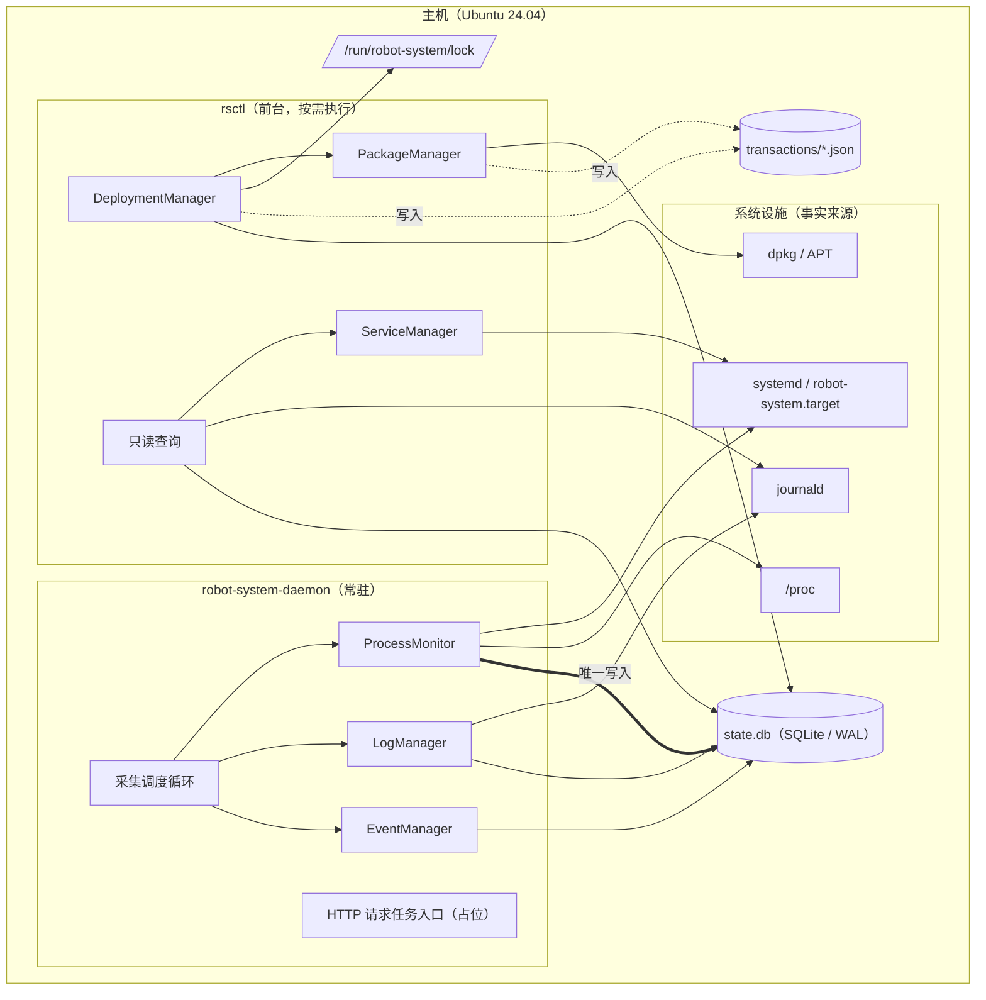
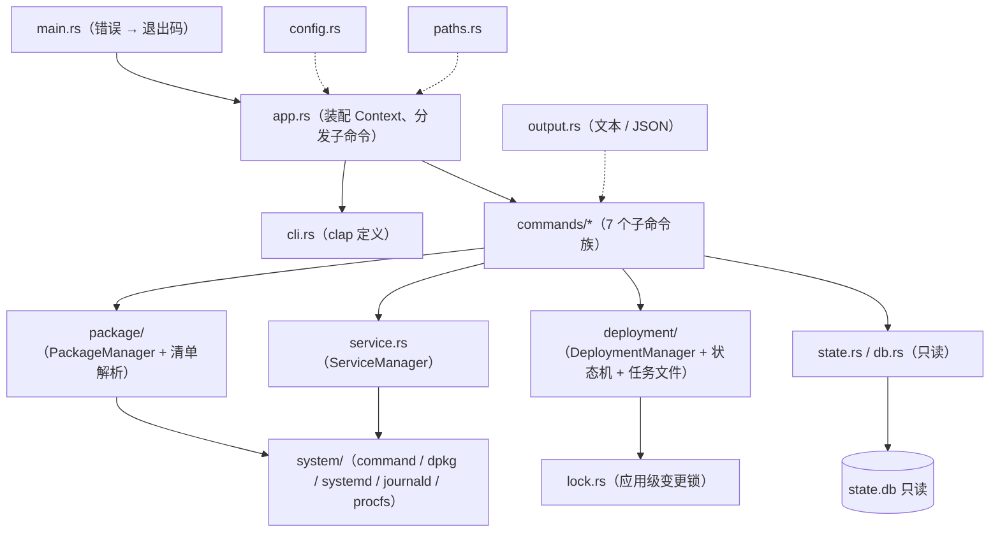
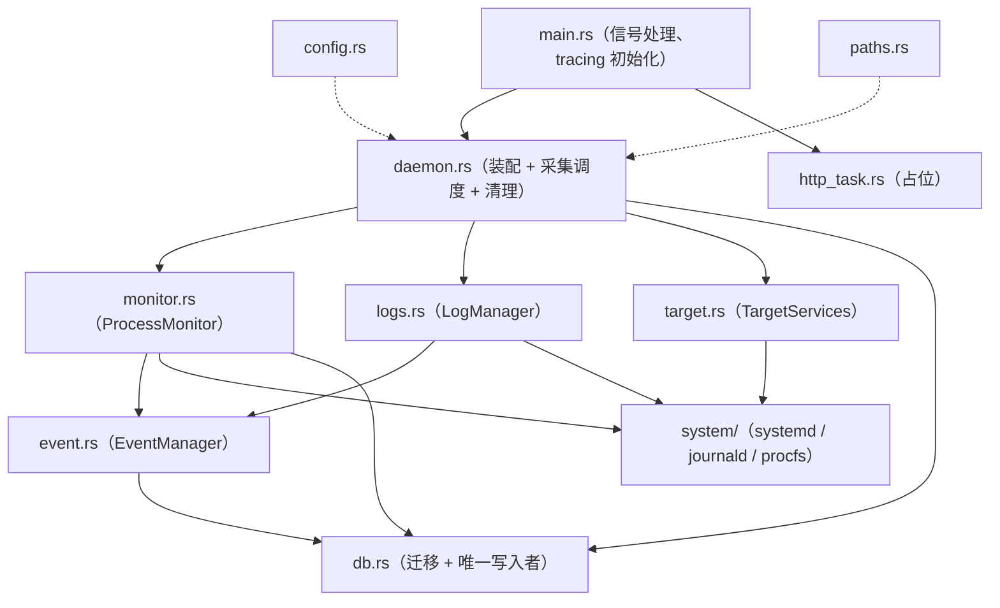
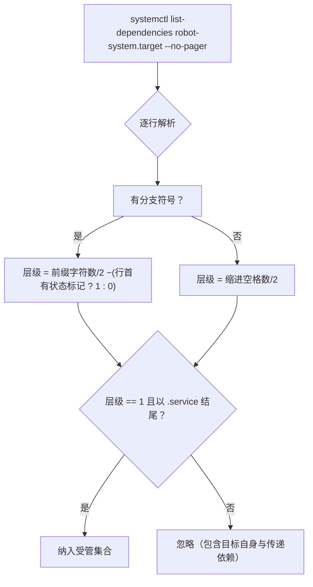
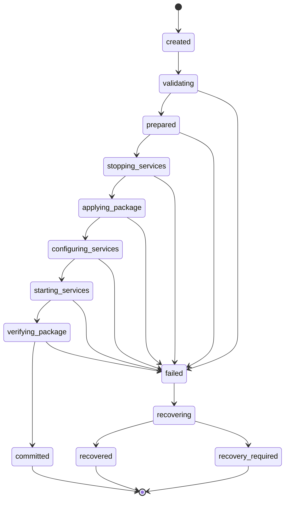
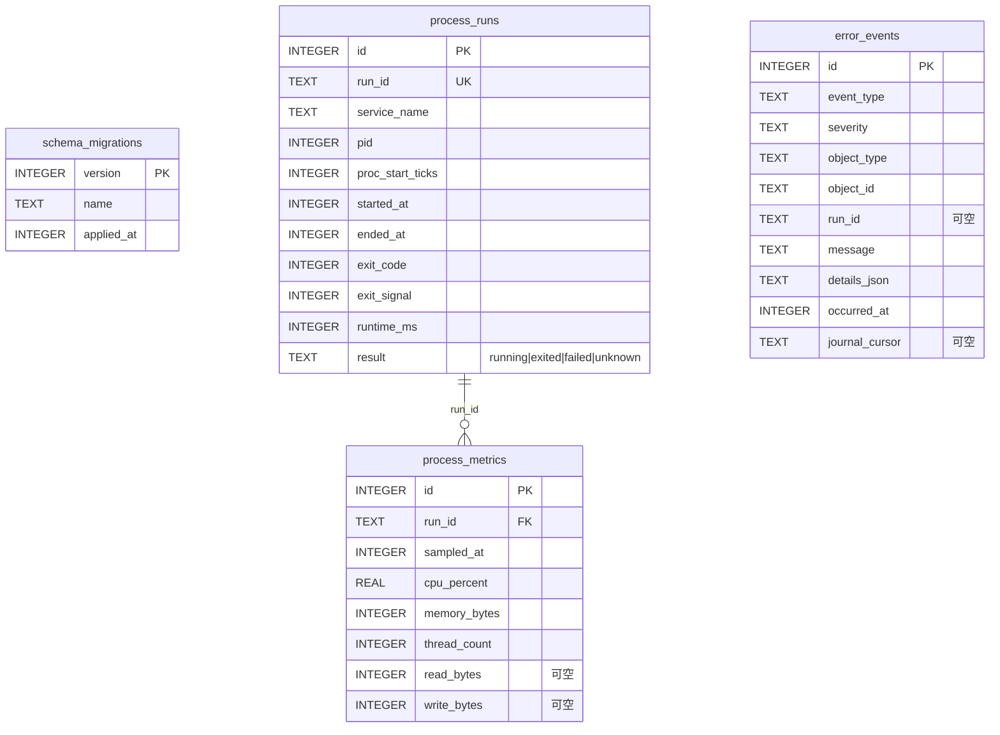
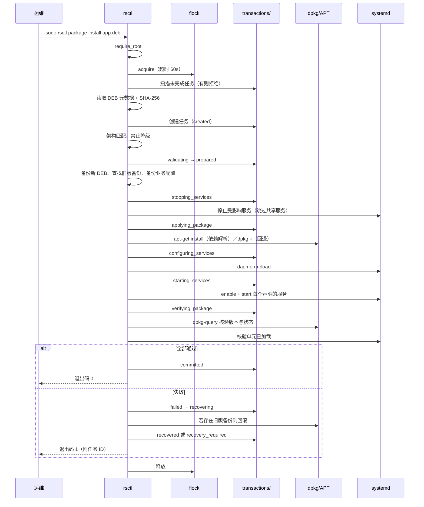
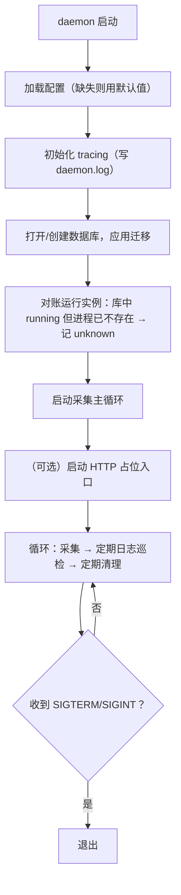

# robot-system 架构文档

- **文档类型**：实现架构（as-built）—— 描述**代码中实际存在**的结构与机制
- **文档位置**：`docs/ARCHITECTURE.md`（安装后位于 `/opt/robot-system/doc/`）
- **章节引用**：代码注释与本文件中的「见架构文档 §X.Y」均指本文档章节
- **代码版本**：v0.1.0，Rust `edition 2024`，MSRV 1.88
- **实现状态**：软件包管理、部署编排、服务管理、运行监控均已实现；HTTP API 为占位

---

## 1. 系统概览

系统由两个**相互独立**的程序组成。这是本架构最重要的结构性决策：

| 程序 | 运行方式 | 权限 | 职责 |
|---|---|---|---|
| `rsctl` | 前台按需执行 | 变更类操作需 root（`sudo`） | 软件包管理、部署编排、服务启停、安装校验，以及运行状态的**只读**查询 |
| `robot-system-daemon` | 常驻服务（systemd 管理） | root（受 unit 沙箱限制） | 进程监听、资源指标采集、日志整理、错误事件记录；HTTP 请求任务入口（占位） |

**独立性边界（硬约束）**：不共享 Rust 库（两个 crate 各有一份系统适配层，如各自的
`system/systemd.rs`）；无 IPC / Socket / 共享内存。唯一耦合点是**共享的 SQLite 结构**与
systemd / journald / `/proc` 等系统设施。由此：**常驻服务不可用时，`rsctl` 的软件包与
服务操作完全不受影响**（仅历史可能不完整），反之亦然。

### 1.1 组件拓扑



> 说明：`DM --> DB` 仅表示 `rsctl` **读取**数据库（对账与查询），`rsctl` 从不写入 SQLite。

### 1.2 数据所有权

单一写入者模型消除了跨程序写入竞争：

| 数据 | 唯一写入者 | 读取者 |
|---|---|---|
| `process_runs` / `process_metrics` / `error_events` | daemon | daemon（写）、rsctl（只读） |
| 部署任务文件 `transactions/*.json` | rsctl | rsctl |
| DEB 备份 `backups/*.deb` | rsctl | rsctl |
| `/run/robot-system/lock` | rsctl（`flock`） | rsctl |
| `/var/log/robot-system/daemon.log` | daemon | 运维 |
| 原始服务日志 | journald | rsctl（按需查询）、daemon（巡检） |

---

## 2. 运行视图

设备上与本系统相关的 systemd 单元只有三类：

| 单元 | 提供者 | 位置 | 说明 |
|---|---|---|---|
| `robot-system.target` | 本项目 | `/etc/systemd/system` | 业务服务的统一组织入口；便于管理员覆盖 |
| `robot-system-daemon.service` | 本项目 | `/usr/lib/systemd/system` | 常驻服务自身 |
| `robot-*.service` | **各业务软件包的 DEB** | `/usr/lib/systemd/system` | 本项目不提供、不安装、不修改 |

业务服务以 `WantedBy=robot-system.target` 声明归属，`enable` 后在
`/etc/systemd/system/robot-system.target.wants/` 下生成链接，成为 target 的直接依赖；
常驻服务独立运行、不隶属该 target。**target 不是软件包数据库**：它只表达依赖关系，
软件包清单仍由 dpkg 维护。

---

## 3. 逻辑架构（模块分解）

### 3.1 `rsctl`（约 4.7k 行）



| 模块 | 职责 |
|---|---|
| `system/command.rs` | 安全的外部命令执行：参数数组、固定 `LANG`/`LC_ALL`、禁止 shell 拼接 |
| `system/dpkg.rs` | dpkg / APT 适配、DEB 控制字段、SHA-256、版本比较 |
| `system/systemd.rs` | `show` / `list-units` 解析，**依赖发现**，启停启用 |
| `system/journald.rs` | journald JSON 输出解析、时长简写归一化 |
| `system/procfs.rs` | `/proc/<pid>/stat` 解析、启动时钟值、`_SC_CLK_TCK` |
| `package/` | 包查询与安装、DEB 元数据校验、服务清单解析 |
| `deployment/` | 部署状态机、任务文件原子持久化、失败恢复 |
| `service.rs` | 服务状态汇总、target 服务发现、生命周期操作 |
| `lock.rs` | 受管变更的 `flock` 串行化 |
| `db.rs` / `state.rs` | SQLite **只读**访问（`SQLITE_OPEN_READ_ONLY`） |
| `output.rs` | `--json` 与人类可读双模式、时间/时长/字节格式化 |

### 3.2 `robot-system-daemon`（约 3.2k 行）



| 模块 | 职责 |
|---|---|
| `daemon.rs` | 装配、启动对账、每周期采集、定期清理、日志巡检节流 |
| `monitor.rs` | 运行实例追踪、状态跃迁判定、资源采样 |
| `target.rs` | 经 systemd 依赖发现受管服务 |
| `logs.rs` | journald 增量巡检（游标去重）→ 错误事件 |
| `event.rs` | 事件类型/级别定义与构造、写入 |
| `db.rs` | 建库、迁移、写入、保留策略清理 |
| `http_task.rs` | HTTP 入口占位（一切请求 `501`） |

### 3.3 两个程序的重复实现是有意的

`system/*`、`paths.rs`、`config.rs` 在两个 crate 中各有一份，是“不共享 Rust 库”的直接
代价，换来两个程序可独立开发、部署与升级。属于**已知并接受**的成本（见 §1、§9）。

---

## 4. 关键机制

### 4.1 服务发现：以 systemd 依赖关系为准

**信息来源**：`systemctl list-dependencies <managed_target>` 的**第 1 层直接依赖**，
过滤出 `.service` 单元。

选择这个方案的动因：业务服务的 unit 由各自的 DEB 提供，本项目不应维护一份可能过期的
清单副本。systemd 自身就是权威来源。

**两个必须避开的坑**（都已在实现中处理，并有回归测试）：

1. **不能使用 `--plain`**。`--plain` 会把树形缩进拍平，使直接依赖与传递依赖缩进相同。
   而递归展开会引入大量无关服务——业务服务常声明 `Wants=network-online.target`，它会把
   整个网络栈的服务带进来。实测 `multi-user.target`：直接依赖 26 个，递归展开 62 个。
2. **必须同时支持 UTF-8 与 ASCII 两套树形符号**。`system/command.rs` 固定设置
   `LANG=C`/`LC_ALL=C` 以保证输出可稳定解析，但副作用是 systemd 会从
   `● ├─name` 退回 ASCII 的 `* |-name`。因此解析器按**字符单元格**（每层 2 字符）计算
   层级，分支符号集合为 `├` `└` `|` `` ` ``；当所有条目同层时 systemd 省略符号，此时
   退化为按缩进判断。



**降级为归属展示的服务清单**：DEB 可在 `/opt/robot-system/packages/<pkg>.toml` 声明
服务，但只用于 `rsctl package info` 展示与卸载时的共享服务判断；清单缺失不影响服务的
管理，`service list` 归属列显示 `-`。本包只建 `packages/` 与 `config/apps/` 目录、
不预置任何业务侧文件（否则会出现“从未安装过、却出现在 `package list` 中”的幽灵软件包）。
两类文件的格式见 §5.5。

### 4.2 运行实例身份

PID 会被内核复用，因此**不能只凭 PID 判定"同一个进程"**。运行实例的身份是三元组：

```
run_id（UUID，本项目生成） + pid + /proc/<pid>/stat 的 starttime（内核启动时钟值）
```

判定逻辑：仅当 `pid` 与 `proc_start_ticks` 都与库中记录一致时，才认为是同一个实例；
否则视为**服务重启**，为上一实例收尾（结果记 `unknown`，因为无法确知其退出原因），并
生成新的 `run_id`。绝不覆盖历史记录。

### 4.3 指标采集与 CPU 计算

- 采集周期：`sample_interval_secs`，默认 5 秒。
- 内存：`/proc/<pid>/stat` 的 RSS 页数 × 页大小。
- 线程数：同上的 `num_threads`。
- **CPU 使用率**：相邻两次采样之间的时钟滴答差 / 经过的墙钟时间，再按 `_SC_CLK_TCK`
  归一：

  $$\text{cpu\\_percent} = \frac{\Delta \text{ticks}}{\Delta t \times \text{CLK\\_TCK}} \times 100$$

  首次采样缺少基线，记 `0.0` 而非猜测值；daemon 启动对账时会为存活实例预热基线。
- 资源边界：优先信任 systemd 提供的 `MainPID`（`MainPID` 不覆盖
  所有子进程，完整的 cgroup 统计属于后续优化）。

### 4.4 事件生成规则

`ProcessMonitor` 每轮的判定顺序（`status.is_transitioning()` 时跳过，避免在
`activating`/`deactivating` 中间态误判）：

| 条件 | 动作 |
|---|---|
| 无对应运行实例 | 无操作 |
| 单元未加载（`LoadState=not-found`） | 跳过（target 可能先于 DEB 存在） |
| `active` 且 `MainPID == 0` | `Type=oneshot` 已执行完毕：为未收尾实例按 systemd 记录收尾；`failed` 则报 `process_exited_abnormally` |
| `active` 且 PID/启动时钟值一致 | 沿用当前 `run_id`，写入一条指标采样 |
| `active` 且身份不一致 | 上一实例按 `unknown` 收尾 → 新建 `run_id` |
| 非活动且有开放实例 | 按 systemd 结果收尾；`failed` → `process_exited_abnormally`；`exited` 且此前为 `active` 且非 oneshot → `service_stopped_unexpectedly` |
| 非活动、无开放实例、`failed`、且上一轮不是 `failed` | `service_start_failed`（仅记录一次，避免刷屏） |

日志侧（`LogManager`）：按 `journal_lookback_secs`（默认 300s）回溯，用
`latest_cursor()` 保存的上次 journal 游标做增量读取，只关注 `warning` 及以上级别，
经 `has_recent_event()` 去重后记为 `service_log_error`。巡检**不与采集同频**：默认每
30 秒一次（`LOG_SCAN_INTERVAL_SECS / sample_interval`），单次最多 200 条。

事件类型（`event.rs`）：

| 常量 | 值 | 级别 |
|---|---|---|
| `SERVICE_START_FAILED` | `service_start_failed` | error |
| `SERVICE_STOPPED_UNEXPECTEDLY` | `service_stopped_unexpectedly` | warning |
| `PROCESS_EXITED_ABNORMALLY` | `process_exited_abnormally` | error |
| `SERVICE_LOG_ERROR` | `service_log_error` | 由 syslog 优先级映射（≤2 critical / 3 error / 其余 warning） |

> `SERVICE_LOG_ERROR` 是在进程/服务事件之外的扩展类型，用于把日志中的异常纳入结构化事件。

### 4.5 部署状态机与恢复



**持久化语义**：每次状态跃迁与每条步骤记录都立即写入
`/var/lib/robot-system/transactions/<task-id>.json`（临时文件 + 原子 `rename`），因此
进程被 `kill -9` 或断电后仍能查到"卡在哪个阶段"。

**恢复策略**：仅在能找到旧版本 DEB 备份时才尝试回滚（安装/升级）或重装（卸载）；否则进入
`recovery_required`。关键判断是——**部署事务的持久化不等于可回滚的事务**：maintainer
scripts 可能启动服务或产生外部副作用，无法通过回滚任务文件撤销。系统宁可如实报告“需要
人工处理”，也不谎报回滚成功。

**变更前置检查**：`check_incomplete()` 在执行新变更前扫描未完成任务并拒绝执行，实现
"对账不依赖常驻服务"的要求。

### 4.6 变更串行化与锁的边界

- 实现：`/run/robot-system/lock` 上的 `flock(LOCK_EX | LOCK_NB)` 轮询，超时由
  `lock_timeout_secs` 控制（默认 60s），超时报错而非无限等待。
- 覆盖范围：**软件包操作与服务控制两类受管变更**统一走该锁，使 `rsctl` 发起的变更彼此
  串行化。**只读查询不加锁**，避免查询与变更相互阻塞。
- **局限**：这是**应用级**锁，只能约束遵守它的 `rsctl` 进程——无法阻止直接用 APT /
  dpkg / `systemctl` 或 `unattended-upgrades`；dpkg 自身的锁也只保护单个包操作，不保护
  “读旧状态 → 停服务 → 安装 → 校验” 的整个编排窗口。因此以**变更前后重新核验实际版本与
  状态**（而非只看返回码）作为补偿。

### 4.7 并发模型

| 位置 | 机制 |
|---|---|
| daemon 内部 | 数据库连接包在 `Mutex`；采集与清理经 `spawn_blocking` 串行，避免阻塞 Tokio 工作线程 |
| daemon 与 rsctl | 由“单一写入者”消除 |
| rsctl 变更之间 | 应用级 `flock`（§4.6） |
| 外部工具 | 无强制手段，依靠前后核验与审计（§4.6） |

---

## 5. 数据架构

### 5.1 SQLite（`/var/lib/robot-system/state.db`）

只保存 daemon 采集的**运行数据**，三张业务表 + 一张迁移记录表：



连接参数（两侧一致，避免行为差异）：

| 参数 | daemon（读写） | rsctl（只读） |
|---|---|---|
| 打开模式 | 读写 | `SQLITE_OPEN_READ_ONLY \| SQLITE_OPEN_NO_MUTEX` |
| `journal_mode` | `WAL` | 沿用 |
| `synchronous` | `NORMAL` | 沿用 |
| `foreign_keys` | `ON` | 沿用 |
| `busy_timeout` | 5s | 5s |

**迁移**：daemon 启动时读取 `/opt/robot-system/migrations/*.sql`，按文件名前缀版本号排序，
跳过 `schema_migrations` 中已有的版本；每个脚本在独立事务中执行，避免"结构改了一半"。
rsctl **不迁移**，只读。

**索引**（`0002_add_runtime_indexes.sql`）：`process_runs(service_name, started_at)`、
`process_runs(result)`、`process_metrics(run_id, sampled_at)`、
`error_events(occurred_at)`、`error_events(event_type, occurred_at)`、
`error_events(object_type, object_id, occurred_at)`。

**数据缺失的处理**：数据库可能根本不存在（daemon 从未运行）。此时 `rsctl` **不报错**，
而是回退为直接查询 systemd / journald / `/proc`，并明确提示"历史不可用"。

### 5.2 部署任务文件

`/var/lib/robot-system/transactions/<task-id>.json`，内容含任务 ID、类型、包名、源/目标
版本、架构、来源 DEB 路径与 SHA-256、当前状态、操作者、时间戳、错误与恢复说明，以及完整
的**步骤流水**。序列化后落盘，按 `created_at` 倒序枚举。

### 5.3 文件系统布局

```text
/opt/robot-system/                 # 程序与静态资源（可随版本整体替换）
├── bin/{rsctl, robot-system-daemon}
├── config/apps/*.toml             # 业务覆盖配置（升级前会被备份）
├── packages/*.toml                # DEB 提供的服务清单（仅用于归属展示）
├── migrations/*.sql               # 由 daemon 在启动时应用
└── doc/                           # 随版本安装的文档（unit 的 Documentation= 指向此处）

/var/lib/robot-system/             # 持久数据
├── state.db                       # SQLite（daemon 写入，rsctl 只读）
├── backups/                       # 旧版本 DEB 与配置备份
└── transactions/                  # 部署任务文件

/run/robot-system/                 # 运行时目录（tmpfs，重启即清空）
└── lock                           # 应用级变更锁；目录与文件由 rsctl 按需创建
/var/log/robot-system/daemon.log   # daemon 自身日志
/etc/robot-system/robot-system.conf # 两侧共用的 TOML；conffile（升级保留运维改动），见 §5.5
/etc/systemd/system/robot-system.target
/usr/lib/systemd/system/robot-system-daemon.service
/opt/robot/                        # 业务程序（不属于本项目）
```

**分发与归属**：`/opt/robot-system/` 下的程序与静态资源、上述两个 systemd 单元、以及
`/usr/bin/rsctl`（指向 `/opt/robot-system/bin/rsctl` 的符号链接）都由本包的一个 DEB
提供，主配置安装到 `/etc/robot-system/robot-system.conf`，由 `scripts/make_deb.sh`
生成。该 DEB 的维护者脚本承担原有安装脚本的职责：

| 脚本 | 动作 |
|---|---|
| `postinst` | 建立 `/var/lib/robot-system{,/backups,/transactions}`、`/var/log/robot-system`、`/run/robot-system`；`daemon-reload`、`enable` 并启动 `robot-system.target` 与常驻服务 |
| `prerm` | 只停止常驻服务；**不动业务服务**（它们属于其它包） |
| `postrm` | `remove`/`purge` 时移除 `enable` 生成的 `.wants` 链接并 `daemon-reload`；`purge` 时另外删除 `/var/lib/robot-system`、`/var/log/robot-system`、`/run/robot-system` |

`packages/` 与 `config/apps/` 只建目录，**内容全部来自业务 DEB**（见 §4.1）。

### 5.4 保留策略

| 数据 | 默认保留 | 清理者 |
|---|---|---|
| `process_metrics` | 30 天 | daemon |
| `process_runs`（仅已结束的） | 90 天 | daemon |
| `error_events` | 180 天 | daemon |
| 原始日志 | journald 自身配额 | journald |
| 任务文件 | 180 天以上（成功任务） | rsctl |
| 备份 DEB | 每包最近 3 个（`BACKUP_KEEP`） | rsctl（部署后顺带清理） |

清理采用**分批删除**（每批 1000 行）以避免长时间持锁；daemon 每 720 个采集周期
（5 秒周期下约 1 小时）执行一次。**仍在运行的实例永不清理**（`result <> 'running'`）。


### 5.5 配置文件与业务侧文件格式

**主配置**（`/etc/robot-system/robot-system.conf`）由本包的 DEB 从仓库的
`etc/robot-system.conf` 装入，并**登记为 conffile**：升级时 dpkg 会比较包内默认值
与本地内容，若运维改过则保留本地内容，并把新版本写成 `.dpkg-dist` 供比对（若包内与本地
都未变则直接更新）。两个程序共用同一个 TOML 文件，各自只读取自己关心的字段，未声明的
字段使用默认值。该文件**不是运行必需的**——缺失时两侧直接使用默认值，因此它只是“把
默认值写出来供编辑”的模板。可用的键与默认值：

| 键 | 默认值 | 使用方 | 说明 |
|---|---|---|---|
| `managed_target` | `"robot-system.target"` | 两侧 | 受管服务由该 target 的依赖关系确定（§4.1） |
| `lock_timeout_secs` | `60` | rsctl | 变更锁的等待超时；超时报错而非无限等待（§4.6） |
| `sample_interval_secs` | `5` | daemon | 采集周期（§4.3） |
| `journal_lookback_secs` | `300` | daemon | 每次日志巡检回溯的时间窗口（§4.4） |
| `metrics_retention_days` | `30` | daemon | 指标保留天数（§5.4） |
| `runs_retention_days` | `90` | daemon | 已结束运行实例的保留天数 |
| `events_retention_days` | `180` | daemon | 错误事件保留天数 |
| `http_enabled` | `false` | daemon | 是否启用 HTTP 请求任务入口（占位，§10） |
| `http_listen` | `"127.0.0.1:8790"` | daemon | HTTP 入口地址（仅 `http_enabled` 为真时生效） |

显式写出全部键（取值即默认值）：

```toml
managed_target = "robot-system.target"
lock_timeout_secs = 60

sample_interval_secs = 5
journal_lookback_secs = 300
metrics_retention_days = 30
runs_retention_days = 90
events_retention_days = 180

http_enabled = false
http_listen = "127.0.0.1:8790"
```

**以下两类文件不由本项目提供**，由各业务软件包的 DEB 安装（§4.1）。

服务清单 `/opt/robot-system/packages/<包名>.toml`：把服务关联回软件包。`depends` 可选，
用于卸载前的依赖检查。

```toml
package = "robot-lidar"
version = "1.2.0"
depends = ["robot-core"]

[[services]]
name = "robot-lidar.service"

[[services]]
name = "robot-lidar-diagnostics.service"
```

业务覆盖配置 `/opt/robot-system/config/apps/<包名>.toml`：字段由业务自定义；升级该包前
`rsctl` 会把它备份到 `/var/lib/robot-system/backups/`。

```toml
device = "/dev/ttyUSB0"
frame_id = "lidar_link"
publish_rate_hz = 10
```

---

## 6. 交互时序

### 6.1 安装 / 升级



**退出码约定**：仅 `committed` 返回 0；`recovered`（已回滚）与 `recovery_required`
（需人工处理）都返回非零，防止脚本把失败的部署当成成功。

### 6.2 采集循环

每个 `sample_interval_secs`（默认 5s）：`list-dependencies` 取受管服务 → 逐个
`systemctl show` 取状态/PID/退出信息 → 读 `/proc/<pid>/stat`（PID、启动时钟值、CPU、
RSS、线程）→ 按 §4.4 的判定写 `process_runs` / `process_metrics` / `error_events`。
每 30s 做一次 journald 增量巡检（`--after-cursor`，warning 及以上去重入库）；每 720 个
周期（约 1 小时）分批清理过期数据。判定与事件细节见 §4.3、§4.4。

### 6.3 启动与恢复



**职责边界**：daemon 启动时**只对账运行实例**，不触碰软件包或部署任务；后者由 `rsctl` 在
每次变更前完成。这是两程序职责分离的直接体现。

---

## 7. 安全模型

| 层面 | 措施 |
|---|---|
| 权限 | 变更类操作由 `rsctl` 在 root 下执行；daemon 也以 root 运行（**不创建专用系统用户**，因需跨用户读 `/proc` 与 journald），能力由 unit 沙箱限制：`NoNewPrivileges`、`ProtectSystem=strict`、`ProtectHome`、`PrivateTmp`、`ProtectKernelTunables`、`ProtectControlGroups`、`RestrictSUIDSGID`，仅 `ReadWritePaths` 开放 `/var/lib/robot-system`、`/var/log/robot-system` 可写 |
| 命令执行 | 全部使用 `Command` 参数数组，**从不** `sh -c` 拼接；参数进入 `Command` 前先经 `validate_unit_name()` / `validate_package_name()` 校验字符集 |
| 包可信度 | 安装前校验包名/版本/架构、SHA-256、架构匹配；拒绝非法降级；优先让受控 APT 解析依赖 |
| 审计 | 部署任务文件记录操作者（`SUDO_USER`/`USER`）、请求时间、对象、参数摘要、结果、错误与恢复详情 |
| 容量 | 数据库有保留策略，daemon 日志与 journald 各自有配额，避免磁盘耗尽 |

**已知信任边界**：maintainer scripts 以 root 执行，故**软件包来源的可信度本身就是系统的
安全边界**；当前支持本地 DEB 与 `apt-get` 依赖解析，**尚未实现签名仓库与元数据验证**。

---

## 8. 一致性模型

系统存在多个无法由单个事务同时提交的事实来源，因此采用**最终一致**策略：

| 关注点 | 权威来源 | 本项目角色 |
|---|---|---|
| 软件包安装状态与版本 | dpkg / APT | 查询并对账，不缓存为权威 |
| 受管服务集合 | systemd 依赖关系 | 查询 |
| 服务启用与运行状态 | systemd | 查询 |
| 当前进程与资源 | `/proc` | 采样并留痕 |
| 原始日志 | journald | 查询 |
| 运行历史、指标、运行类事件 | 本项目 SQLite | 采集与保存（派生数据） |

**冲突处理原则**：以系统实际状态为准修正本地记录，并保留审计记录——运行实例对账时进程
已消失但记录仍为 `running` 则记 `unknown`（不推断退出原因）；部署前重新核验 dpkg/systemd
的实际版本与状态（不依赖上次记录或命令返回码）。

---

## 9. 关键设计决策与权衡

| 决策 | 选择 | 理由与代价 |
|---|---|---|
| 程序划分 | 两个独立程序、零共享代码 | 边界清晰、可独立演进；代价是系统适配层重复实现 |
| 数据库写入 | 单一写入者（daemon） | 彻底消除跨进程写竞争；代价是 rsctl 无法记录自己的运行态数据（改由任务文件承担） |
| 状态保存 | 运行态入库、部署态入文件 | 各存其所属；文件天然支持"卡住的任务"排查与人工介入 |
| 服务发现 | systemd 依赖关系 | 唯一权威来源，避免清单副本过期；代价是依赖 `list-dependencies` 的文本输出（已用两套符号解析 + 回归测试兜底） |
| 进程身份 | UUID + PID + 启动时钟值 | 免疫 PID 复用；代价是每次采样需读 `/proc` |
| 无法确认的退出 | 记 `unknown` | 不伪造数据，便于事后审计；代价是部分记录信息量较低 |
| 部署失败 | 显式区分 recovered / recovery_required | 不谎报回滚成功；代价是运维需要处理人工介入状态 |
| 变更串行化 | 应用级 `flock` + dpkg 自身锁 | 成本低、语义清晰；**明确承认**无法约束绕过协议的操作者，因此辅以前后核验 |
| HTTP 入口 | 占位（501） | 在确定变更类请求的执行路径之前不预设立场 |
| CLI 形态 | 单一 `rsctl` + 子命令 | 降低初期复杂度；模块划分已按未来拆分预留 |

---

## 10. 已知限制与演进方向

**当前限制**

1. HTTP API 只有占位入口，任何请求返回 `501`。
2. 未实现签名 APT 仓库与元数据验证。
3. 服务操作经 `systemctl` 命令而非 systemd D-Bus。
4. 资源统计以 `MainPID` 为边界，未使用 cgroup，因此不覆盖服务的全部子进程。
5. 应用级锁无法阻止绕过协议的外部变更。
6. `uuid` 因 MSRV 约束停留在 1.26.x（1.27 要求 Rust 1.89，当前 `rust-version = "1.88"`）。
7. 未跟踪 systemd 配置目录的变更（`daemon-reload` 之外的直接编辑）——留待定期对账解决。

**演进方向**

| 方向 | 说明 |
|---|---|
| systemd D-Bus | 以 `org.freedesktop.systemd1` 替代 `systemctl` 调用，同时获得状态变化的订阅能力（第一步即替换当前轮询） |
| cgroup 资源统计 | 按服务 cgroup 汇总 CPU/内存，覆盖子进程 |
| 事件驱动取代轮询 | 订阅 systemd `PropertiesChanged` / `JobRemoved`，减少采样延迟并降低开销 |
| HTTP API | 需先确定变更类请求的执行路径（转交 `rsctl` 或另建执行通道），再补充认证、访问控制与审计 |
| 受控仓库 | 引入签名仓库与 `rosdep` 风格的依赖校验 |

---

## 附录 A：模块索引

### `rsctl`

| 文件 | 关键类型 / 函数 |
|---|---|
| `main.rs` | 错误 → 退出码映射（`--json` 时输出 JSON 错误） |
| `app.rs` | `Context`、子命令分发 |
| `cli.rs` | `Cli`、`Command` 及各子命令枚举 |
| `config.rs` | `Config`（`lock_timeout_secs`、`managed_target`） |
| `paths.rs` | `Paths`（`detect` / `with_prefix`） |
| `error.rs` | `Error` 枚举（含 `IncompleteTask`、`LockBusy`、`PermissionDenied`） |
| `lock.rs` | `ManagedLock::acquire` |
| `output.rs` | `Format`、`emit`、`fmt_time`、`fmt_duration_ms`、`fmt_bytes`、`dash` |
| `package/mod.rs` | `PackageManager`、`validate_package_name` |
| `package/manifest.rs` | `PackageManifest`、`ServiceDecl` |
| `deployment/mod.rs` | `DeploymentManager`、`Tx`（事务写入器） |
| `deployment/state.rs` | `TaskKind`、`TaskState`、`StepOutcome` |
| `deployment/store.rs` | `DeploymentTask`、`TaskStep`、`TaskStore` |
| `service.rs` | `ServiceManager`、`ManagedService` |
| `db.rs` | `ReadOnlyDb`、`ProcessRun`、`MetricSample`、`ErrorEvent` |
| `state.rs` | `StateStore`（历史不可用时的降级语义） |
| `system/mod.rs` | 适配层入口 |
| `system/command.rs` | `run`、`run_checked`、`require_root`、`exists` |
| `system/dpkg.rs` | `query`、`deb_field`、`sha256_file`、`compare_versions`、`install_local`、`remove` |
| `system/systemd.rs` | `show`、`list_services`、**`service_dependencies`**、`parse_service_dependencies`、`validate_unit_name` |
| `system/journald.rs` | `query`、`LogEntry`、`normalize_since` |
| `system/procfs.rs` | `read_stat`、`start_time_unix`、`clock_ticks`、`boot_time_secs` |
| `commands/` | 7 个子命令族：`package.rs`、`service.rs`、`system.rs`、`process.rs`、`metrics.rs`、`events.rs`、`logs.rs` |

### `robot-system-daemon`

| 文件 | 关键类型 / 函数 |
|---|---|
| `main.rs` | `init_tracing`、`run_collection_loop`、`shutdown_signal` |
| `daemon.rs` | `Daemon`（`reconcile` / `tick` / `prune` / `validate_environment`）、`lock` |
| `config.rs` | `Config`（`managed_target`、采样周期、保留策略、HTTP 开关） |
| `paths.rs` | `Paths`（`detect` / `state_db` / `migrations_dir`） |
| `db.rs` | `Database`（`migrate` / `open_run` / `close_run` / `insert_metric` / `insert_event` / `prune`）、`RunRow`、`PruneStats`、`RetentionPolicy` |
| `monitor.rs` | `ProcessMonitor`（`reconcile` / `tick`）、`TickSummary`、`ReconcileSummary` |
| `target.rs` | `TargetServices` |
| `logs.rs` | `LogManager`（`scan`）、`LogScan` |
| `event.rs` | `Event`、`Severity`、四个事件构造函数 |
| `http_task.rs` | `serve`（占位，`501`） |
| `error.rs` | `Error` 枚举 |
| `system/*` | 与 rsctl 同名的独立实现 |

---

## 附录 B：CLI 速查

```bash
# --- 软件包与部署（变更类需 sudo）---
rsctl package list | info <name> | install <deb> | upgrade <deb> | remove <name>
rsctl package task list | task show <id> | history <name>

# --- 统一 target 与服务 ---
rsctl system status
rsctl service list [--all] | status <unit>
sudo rsctl service start|stop|restart|enable|disable <unit>

# --- 运行状态（只读）---
rsctl process list | history <unit>
rsctl metrics <unit> [--limit N]
rsctl error list [--event-type T] [--service U] [--limit N]
rsctl logs <unit> [--since 10m] [--priority err] [--lines N]

# --- shell 补全（clap_complete 生成，输出到 stdout 或 --output 文件）---
rsctl completions <SHELL> [--output FILE]   # bash|zsh|fish|elvish|powershell

# 全局：--json（机器可读）、--opt-root <DIR>
```

`robot-system-daemon` **零参数**，由 systemd 启动。本地验证用环境变量
`ROBOT_SYSTEM_PREFIX=<dir>` 重定向全部路径。

---

## 附录 C：构建与验证

```bash
cargo build --release --locked         # 构建
cargo test                             # 112 个单元测试（rsctl 47 + daemon 65）
cargo clippy --all-targets --all-features -- -D warnings
cargo fmt --all --check
./scripts/make_deb.sh 0.1.0 /opt/robot-system  # 打包 DEB 到 dist/（需 dpkg-deb、fakeroot）
```

**验证手段**：除单元测试外，`ROBOT_SYSTEM_PREFIX` 可在沙箱中跑通"迁移 → 采集真实服务 →
`rsctl` 查询 → SIGTERM 退出"的完整链路，无需改动宿主系统。服务发现逻辑另与
`systemctl show -p Wants,Requires` 做过交叉比对（26/26 一致）。
