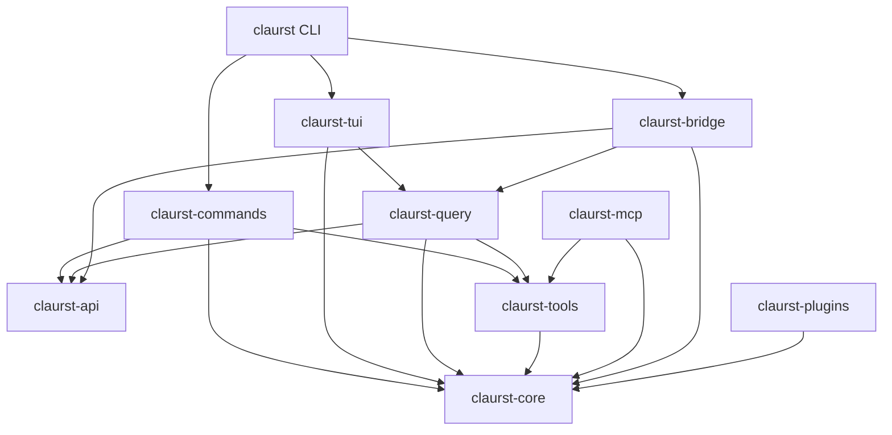

# Robot System 模块说明

本文说明当前 Rust workspace 中各个 crate 的职责、边界和主要协作关系。

## 项目结构

当前项目包含两部分：

1. 根 package `robot-system`：面向 Linux 机器人设备的系统管理工具，提供 `rsctl` 和 `rsvm` 两个二进制。
2. `src/crates` 下的 Claurst 子系统：提供 AI 会话、模型接口、工具调用、TUI 和远程协议能力。

根 package 负责机器人系统安装与服务控制；`src/crates` 下的 crate 负责 Claurst 应用本身。两者共享同一个 Cargo workspace，但职责相对独立。

## 根项目二进制

### `rsctl`

机器人系统服务控制工具。它解析命令行参数，并调用 `systemctl` 对指定的 `<pkg>.service` 执行状态查看、启动、停止和重启操作，同时支持生成 Shell 补全脚本。

### `rsvm`

机器人系统版本和组件管理工具。它读取 `/etc/robot-system/robot-system.conf`，负责组件版本查看、Debian 软件包安装、安装历史查询、服务文件重新加载和系统初始化。

## Claurst crate 总览

| Crate | 主要职责 |
| --- | --- |
| `claurst-core` | 核心状态、配置、会话、认证、权限、记忆和基础业务能力 |
| `claurst-api` | 与模型供应商和远程 API 通信，处理请求、流式响应和协议转换 |
| `claurst-tools` | 工具定义、工具执行和工具调用结果管理 |
| `claurst-query` | 查询/提示词编排和会话交互逻辑 |
| `claurst-tui` | 终端用户界面、输入处理、消息展示和交互状态 |
| `claurst-commands` | CLI 命令实现和命令到核心能力的编排 |
| `claurst-mcp` | Model Context Protocol 集成和 MCP 工具/服务器管理 |
| `claurst-bridge` | 本地 Claurst 与 Web UI 之间的远程会话桥接 |
| `claurst-plugins` | 插件运行时和插件生命周期管理 |
| `claurst-buddy` | Buddy 辅助能力及其数据/状态处理 |
| `claurst` | Claurst 主 CLI，组装各个 crate 并启动应用 |

## 各模块职责

### `claurst-core`：核心领域层

`core` 是 Claurst 的基础领域模块，为其他 crate 提供稳定的底层能力，包括：

- 账户、认证存储、OAuth 和 provider 标识管理
- 会话、远程会话、云端会话和提示词历史
- 配置路径、迁移、导入配置和用户设置
- 上下文压缩、消息处理、输出样式和 token/effort 管理
- 文件历史、记忆目录、目标管理和功能开关
- MCP 信任、LSP、IDE 集成及 Bash/PowerShell 分类
- 加密工具、设备码和其他通用基础设施

它应尽量不依赖 UI，属于整个应用的核心状态和领域能力层。

### `claurst-api`：模型与远程 API 层

`api` 负责把 Claurst 的内部请求转换成不同模型供应商所需的 HTTP/API 格式，并把响应转换回统一结构。主要包含：

- provider 注册、模型注册和 provider 类型
- Anthropic、OpenAI/Codex 等供应商适配
- 请求转换、响应转换和流式响应解析
- 认证、错误处理、provider 错误和 effort 支持
- HTTP 客户端、TLS、JSON、SSE/流式数据处理

该层处理“如何访问模型”，但不负责终端界面或完整会话编排。

### `claurst-tools`：工具执行层

`tools` 为模型提供可调用的本地工具，并负责工具调用的执行、权限和结果回传。它位于模型 API 与核心应用之间，把模型发出的工具请求连接到文件、命令、搜索、浏览器或其他运行时能力。

### `claurst-query`：查询与会话编排层

`query` 负责组织用户输入、上下文、模型请求和响应处理，是一次查询/对话流程的编排层。它连接 `core`、`api`、`tools` 和 `mcp`，使一次用户请求能够完成：

```text
用户输入 -> 上下文组装 -> 模型请求 -> 流式响应 -> 工具调用 -> 最终结果
```

### `claurst-tui`：终端 UI 层

`tui` 负责终端中的可视化交互，包括消息渲染、输入编辑、滚动、状态提示、快捷操作、代码高亮和工具输出展示。它依赖核心状态与查询流程，但不应把 provider 的具体 HTTP 细节直接放入 UI。

该 crate 还提供若干可选功能，例如语音输入、历史选择器、快速搜索、远程桥接模式、记忆和 agent 相关能力。`voice` 特性启用真实麦克风采集，会额外依赖系统音频库。

### `claurst-commands`：命令实现层

`commands` 实现 Claurst 的命令集合，并负责把命令参数转换成核心服务调用。其职责包括：

- 账户、认证、provider 和模型配置
- 会话、历史、搜索、导出、分享和统计
- 权限、沙箱、MCP、插件和托管 agent 管理
- 目标、记忆、远程会话、语音和 UI 设置
- 诊断、doctor、维护和升级相关操作

它是命令行为的集中位置，主 CLI 主要负责解析参数和调用这里的实现。

### `claurst-mcp`：MCP 集成层

`mcp` 负责 Model Context Protocol 集成，管理 MCP server、工具发现、连接和调用结果，并处理 MCP 配置与信任边界。它让外部 MCP 工具能够以统一方式加入 Claurst 的工具调用流程。

### `claurst-bridge`：远程会话桥接层

`bridge` 连接本地 Claurst 与 claude.ai/Web UI，提供：

- 远程会话注册和注销
- Web UI 到本地的长轮询消息接收
- 本地事件向 Web UI 的批量上传
- 权限决定和会话事件传输
- 断线重连、指数退避和取消机制
- 设备指纹、桥接配置和 JWT 过期时间解析

它是专用的远程会话协议适配层，不是通用网络代理。JWT 在该模块中只做解析、过期检查和展示用途，不用于授权决策。

### `claurst-plugins`：插件运行时

`plugins` 提供插件的发现、加载、运行和生命周期管理能力，使 Claurst 可以扩展命令、工具或其他集成，而不必把所有功能编译进核心模块。

### `claurst-buddy`：Buddy 辅助模块

`buddy` 提供 Buddy 相关的辅助数据结构和状态处理能力，并依赖 `core` 使用核心配置/领域类型。它是独立的辅助能力 crate，不负责主 CLI 的启动和终端绘制。

### `claurst`：主 CLI 入口

`cli` crate 的 package 名称为 `claurst`。它负责：

- 初始化运行时和应用依赖
- 解析启动参数和全局选项
- 组装 `core`、`api`、`commands`、`tui` 和其他终端运行所需模块
- 启动交互式 TUI 或非交互命令
- 处理 OAuth、Codex OAuth 和升级流程

它是应用组合根，业务实现应尽量放在对应功能 crate 中。

## 依赖方向



## 一次交互的大致流程

1. `claurst` 解析启动参数并创建运行时。
2. `tui` 或 `commands` 接收用户输入。
3. `query` 从 `core` 获取配置、历史和上下文。
4. `api` 将请求发送给选定的模型 provider。
5. 模型需要工具时，由 `tools` 或 `mcp` 执行并返回结果。
6. `query` 汇总流式响应和工具结果。
7. `tui` 渲染结果；headless 模式则将结果输出到标准输出。

## 构建提示

不启用语音功能时，可以构建全部 workspace：

```bash
cargo build --workspace --no-default-features
```

启用 `claurst` CLI 的默认 `voice` 特性时，Linux 环境还需要 ALSA 开发文件，例如 Debian/Ubuntu 上的 `libasound2-dev`。