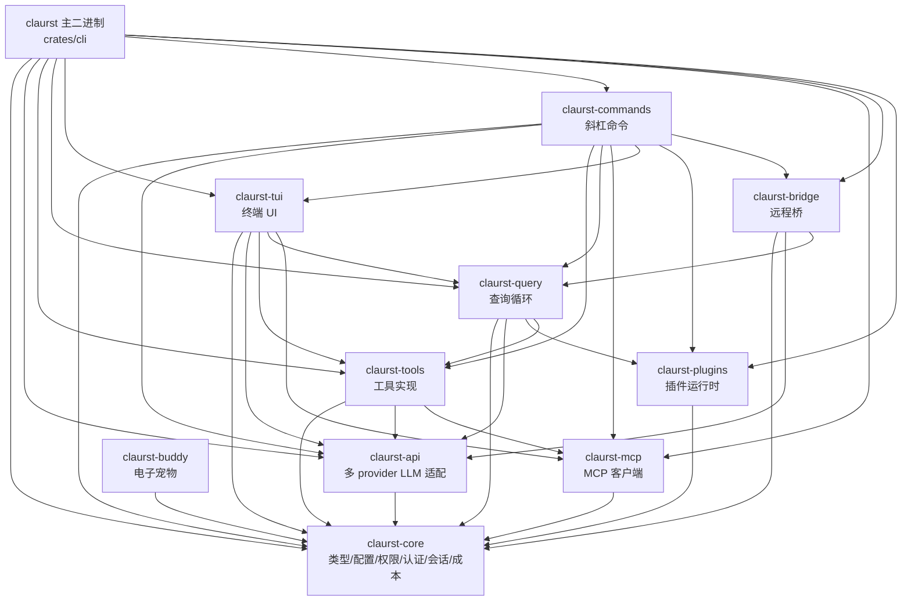
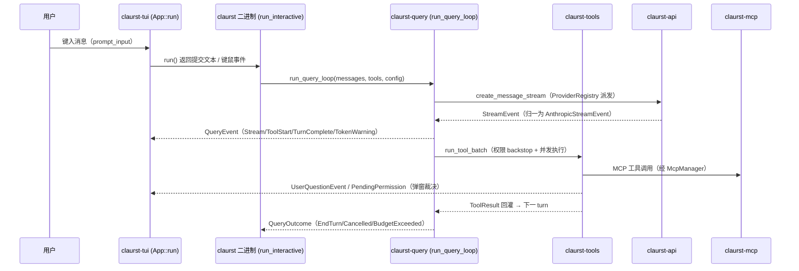

# Robot System / Claurst Workspace 模块总览

本文是 Rust workspace 的**总文档**：概述项目结构、各 crate 职责边界、依赖关系与数据流。每个 crate 的详细解析见 `docs/crates/` 下的独立文档（索引见文末）。

---

## 1. 项目结构

workspace 包含两部分：

1. **根 package `robot-system`**：面向 Linux 机器人设备的系统管理工具。
2. **`crates/` 下的 Claurst 子系统**（11 个 crate）：AI 编码助手的完整实现——模型接口、工具调用、查询循环、TUI、命令系统、MCP、插件、远程桥接等。

## 2. 可执行产物（`crates/cli/src/bin/`）

| 二进制 | 职责 | 详细文档 |
|---|---|---|
| `claurst` | 主程序：CLI 参数解析、配置装载、MCP 接入、headless 查询、交互式 TUI REPL、OAuth 登录、自升级 | [cli.md](crates/cli.md) |
| `rsctl` | 机器人系统服务控制（转发 `systemctl`），独立实现、不依赖 claurst_* 库 | [cli.md](crates/cli.md) |
| `rsvm` | 机器人系统包管理器（读 `/etc/robot-system/robot-system.conf`），独立实现 | [cli.md](crates/cli.md) |

## 3. 库 crate 总览

| Crate | 一句话定位 | 规模 | 详细文档 |
|---|---|---|---|
| `claurst-core` | 核心领域层：类型、错误、配置/Settings、权限、认证、会话持久化、成本、记忆（依赖图最底层） | 26,074 行 / 56 文件 | [core.md](crates/core.md) |
| `claurst-api` | 多 Provider LLM 统一适配层：40+ 上游、流式协议、models.dev 模型目录、TLS 指纹伪装 | 19,303 行 / 34 文件 | [api.md](crates/api.md) |
| `claurst-tools` | 代理工具系统：shell/文件/搜索/Web/任务/团队等全部 LLM 可调用工具 | 12,686 行 | [tools.md](crates/tools.md) |
| `claurst-query` | agentic 查询循环：流式处理、工具派发、auto-compact、预算、goal 续航 | 10,406 行 / 16 文件 | [query.md](crates/query.md) |
| `claurst-tui` | 终端 UI：渲染、输入、overlay/对话框、吉祥物动画 | 45,620 行（最大） | [tui.md](crates/tui.md) |
| `claurst-commands` | slash 命令系统（102 个注册命令）+ named command 框架 | 13,148 行 / 37 文件 | [commands.md](crates/commands.md) |
| `claurst-mcp` | MCP 客户端：JSON-RPC、stdio/HTTP/SSE 传输、OAuth、多服务器管理与重连 | 4,407 行 / 6 文件 | [mcp.md](crates/mcp.md) |
| `claurst-bridge` | 远程控制桥：本地 CLI ↔ claude.ai Web UI 的双向长轮询桥 | 1,710 行（单文件） | [bridge.md](crates/bridge.md) |
| `claurst-plugins` | 插件运行时：发现/manifest/hooks/能力强制/marketplace | 2,649 行 / 7 文件 | [plugins.md](crates/plugins.md) |
| `claurst-buddy` | 电子宠物伴侣系统（确定性生成 + AI 灵魂），尚未接线到 UI | 1,118 行（单文件） | [buddy.md](crates/buddy.md) |
| `claurst`（crates/cli） | 装配层主程序 crate（见上文可执行产物） | 主 bin 4,899 行 | [cli.md](crates/cli.md) |

## 4. 依赖关系图



要点：
- **`claurst-core` 是唯一底座**——其余 10 个 crate 全部直接依赖它，自身零内部依赖。
- **`tools` 不依赖 `query`**——`AgentTool` 放在 query 层以避免 `tools→query→tools` 循环依赖。
- **`commands ↔ tui` 单向依赖**：commands 调 tui 的纯函数（slash 解析、HelpEntry），tui 不调 commands；命令执行统一在 CLI 层。
- **`claurst-buddy` 目前无人依赖**（待接线彩蛋库）。
- core 的 36 个编译期 feature 由 tui/commands 以同名 feature 转发联动。

## 5. 运行时数据流（交互模式）



## 6. 分层架构

```text
┌─────────────────────────────────────────────────────┐
│  claurst 二进制（装配：参数解析/REPL/headless）        │
├──────────────────────────┬──────────────────────────┤
│  claurst-tui（交互渲染）  │ claurst-commands（命令语义）│
├──────────────────────────┴──────────────────────────┤
│  claurst-query（agentic 循环）  claurst-bridge（远控） │
├─────────────────────────────────────────────────────┤
│  claurst-tools（工具实现）                            │
├───────────────────────┬─────────────────────────────┤
│  claurst-api（LLM 适配）│ claurst-mcp   claurst-plugins│
├───────────────────────┴─────────────────────────────┤
│  claurst-core（类型/配置/权限/认证/会话/成本）          │
└─────────────────────────────────────────────────────┘
（claurst-buddy：独立挂在 core 之上，待接入）
```

## 7. 跨 crate 契约点

| 契约 | 说明 |
|---|---|
| `AnthropicStreamEvent`（api） | TUI 消费流的事实标准事件类型；query 负责把所有 provider 归一到它 |
| `Tool` / `ToolContext` / `ToolResult`（tools） | 工具统一抽象；MCP 工具由 cli 用 `McpToolWrapper` 包装成原生 Tool |
| 权限三件套（core） | `PermissionHandler`/`PermissionRequest`/`PermissionDecision`——tools/query/tui 共用 |
| 交互通道三件套 | `QueryEvent`（query→TUI）、`UserQuestionEvent`（tools⇄TUI）、`PendingPermissionStore`（tools→TUI 弹窗 oneshot 决策） |
| `CostTracker`（core） | 贯穿 tools 上下文、query 循环、TUI 显示 |
| `ShadowSnapshot`（core） | auto_commits 的 per-turn 文件变更快照（/undo、/revert 依赖） |
| `EffortLevel`（core） | 全 workspace 唯一推理力度枚举 |
| `Settings::config_dir()`（core） | 全 workspace 配置主目录唯一解析点 |

## 8. 详细文档索引

| 文档 | 内容 |
|---|---|
| [crates/core.md](crates/core.md) | 核心领域层：lib.rs 11 个内联模块、config/permissions 详解、56 文件分组清单、36 个 feature |
| [crates/api.md](crates/api.md) | 6 个核心 trait、protocol/providers/transformers 子目录、35+ 兼容厂商、free 回退链、TLS 伪装 |
| [crates/tools.md](crates/tools.md) | Tool trait、权限三层模型、约 40 个工具分类清单 |
| [crates/query.md](crates/query.md) | run_query_loop 14 步主流程、QueryConfig/Event/Outcome、compact/sanitize/goal/cron 等模块 |
| [crates/tui.md](crates/tui.md) | run loop、`App` 结构体逐字段解析（约 170 个字段，15 个功能区块）、渲染层、30+ 对话框/overlay 清单 |
| [crates/commands.md](crates/commands.md) | SlashCommand/NamedCommand 双 trait、四级命令来源、全部命令分组清单 |
| [crates/cli.md](crates/cli.md) | 三个二进制、build.rs、OAuth/升级流程、40+ CLI 选项 |
| [crates/mcp.md](crates/mcp.md) | McpClient/McpManager、backend 抽象、协议版本协商、OAuth/信任 |
| [crates/bridge.md](crates/bridge.md) | BridgeMessage/BridgeEvent 协议、轮询任务、TUI 集成 |
| [crates/plugins.md](crates/plugins.md) | manifest、27 种 hook 事件、能力强制、marketplace |
| [crates/buddy.md](crates/buddy.md) | 确定性骨骼/AI 灵魂、18 物种精灵图、待接线状态 |
